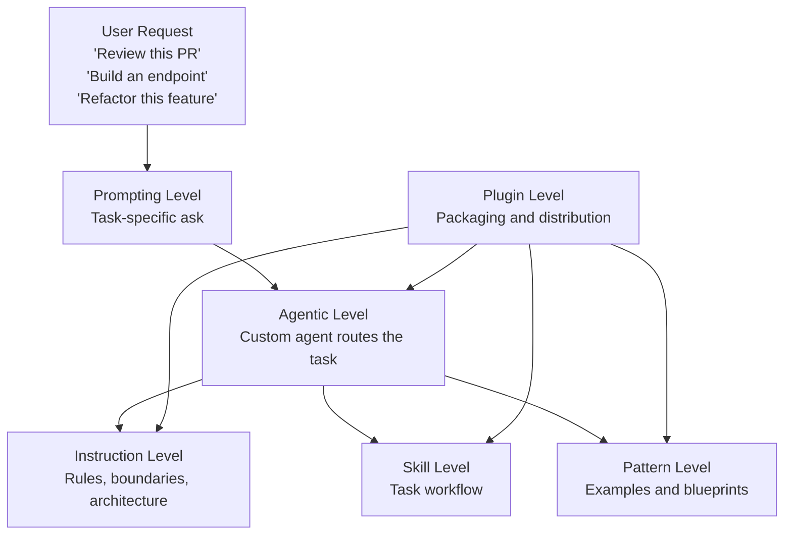

# AI Guidance Levels in This Repo

This document explains the layers of AI guidance used in this repository and how they relate to each other.

It is grounded in the current structure of:

- `D:\works\Agentic\Backend\C#`
- `D:\works\Agentic\Frontend\Vue`

---

## 1. The short version

Think of the stack like this:

1. **Prompting level** tells the AI what you want right now.
2. **Instruction level** gives stable rules for a project or stack.
3. **Agentic level** decides how to route the task and which guidance to load.
4. **Skills** provide repeatable workflows for specific tasks.
5. **Patterns** provide implementation examples.
6. **Plugins** package agents, skills, instructions, tools, and metadata into a distributable unit.
7. **Custom agents** are specialized orchestrators that decide how to work across the guidance.

---

## 2. Visual map



---

## 3. Prompting level

### What it is

Prompting level is the current request from the user to the AI.

It is the most flexible and most immediate layer.

Examples:

- "Create a new endpoint for GET /products"
- "Review this PR for architecture and testing issues"
- "Refactor the payment flow without changing behavior"
- "Add a Vue 3 page for order details"

### What it does

- Defines the immediate goal
- Provides task context
- Supplies business intent, constraints, and acceptance criteria

### What it does not do well by itself

- Enforce architecture consistently
- Teach the AI your team rules
- Reuse the same workflow reliably across tasks

### Example in this repo

Backend prompt:

```text
Review this PR for architecture violations, missing tests, and risky async changes.
```

Frontend prompt:

```text
Create a Vue 3 page to display order history with loading, empty, and error states.
```

Prompting starts the work, but by itself it is not enough to keep behavior consistent.

---

## 4. Instruction level

### What it is

Instructions are stable rules and boundaries.

They are where you define:

- architecture rules
- naming rules
- layer responsibilities
- testing expectations
- project-specific constraints

### What instructions are for

Use instructions for policy and rules that should apply repeatedly.

Examples from your backend:

- `D:\works\Agentic\Backend\C#\instructions\core\01-architecture.instructions.md`
- `D:\works\Agentic\Backend\C#\instructions\core\02-naming.instructions.md`
- `D:\works\Agentic\Backend\C#\instructions\layers\10-domain.instructions.md`
- `D:\works\Agentic\Backend\C#\instructions\layers\11-application.instructions.md`
- `D:\works\Agentic\Backend\C#\instructions\layers\12-infrastructure.instructions.md`
- `D:\works\Agentic\Backend\C#\instructions\layers\13-webapi.instructions.md`
- `D:\works\Agentic\Backend\C#\instructions\cross-cutting\21-testing.instructions.md`

### When to use instruction level

Use instruction level when the rule should remain true across many prompts.

Good instruction examples:

- "No business logic in endpoints"
- "Validation belongs in Application"
- "Use consistent naming"
- "Tests are required for non-trivial logic"

Bad instruction examples:

- "Build the Products endpoint today"

That is a task, so it belongs to prompting or skills, not stable instructions.

---

## 5. Agentic level

### What it is

Agentic level is the orchestration layer.

An agent does not just answer the prompt.
It decides:

- what kind of task this is
- which instructions to load
- which skills to use
- which patterns are relevant
- when to plan first
- when to stop for approval

### In this repo

Your backend agent is here:

- `D:\works\Agentic\Backend\C#\agents\backend-engineer.agent.md`

This file already acts as the backend orchestrator.
It classifies tasks, routes to relevant files, and defines guidance precedence:

- instructions first
- then skills
- then patterns

### Why this matters

Without the agentic layer, the AI has to guess which instructions matter.
With the agentic layer, the system behaves more consistently.

### Example

If the user says:

```text
Create a new API endpoint to place an order.
```

The backend agent can decide to load:

- architecture instructions
- naming instructions
- WebApi instructions
- Application instructions
- endpoint-building skill
- relevant API and application patterns

That routing behavior is the agentic layer.

---

## 6. Skill

### What it is

A skill is a focused workflow for a repeatable task.

Skills are narrower than agents.
An agent orchestrates many possible tasks.
A skill helps execute one kind of task well.

### In this repo

Backend C# skills live here:

- `D:\works\Agentic\Backend\C#\skills`

Examples:

- `build-endpoint.skill.md`
- `build-use-case.skill.md`
- `review-backend-change.skill.md`
- `write-tests.skill.md`

### What a skill should contain

A skill usually defines:

- when to use it
- which instructions to load
- which patterns to reference
- inputs needed
- repeatable steps
- output expectations
- a checklist

### When to use a skill

Use a skill when:

- the task repeats often
- the workflow should be consistent
- the AI tends to miss important steps without guidance

### Example

`build-endpoint.skill.md` is a good skill because building endpoints repeats often and has a stable workflow.

---

## 7. Plugin

### What it is

A plugin is a packaging and distribution unit.

It can bundle:

- agents
- instructions
- skills
- patterns
- scripts
- MCP/tool configuration
- app metadata

### Important distinction

A plugin is not the same thing as a skill.

- A **skill** is task guidance.
- A **plugin** is a container/package that can include many skills and other resources.

### When to use a plugin

Use a plugin when you want to:

- package capabilities for reuse
- share guidance across teams
- distribute a complete AI extension
- include tools, app integration, and metadata in one unit

### Example

A plugin for your backend platform might include:

- backend agent
- backend instructions
- review skill
- endpoint skill
- internal API schemas
- helper scripts
- MCP configs for GitHub or Azure DevOps

---

## 8. Custom agent

### What it is

A custom agent is a specialized orchestrator designed for a domain, stack, or team.

It is the AI role that decides how to work, not just what to say.

### In this repo

Your clearest custom agent example is:

- `D:\works\Agentic\Backend\C#\agents\backend-engineer.agent.md`

This is a custom backend engineering agent because it:

- has a defined mission
- has a guidance hierarchy
- classifies tasks
- routes to skills and instructions
- defines implementation and review behavior

### Difference between custom agent and skill

- A **custom agent** is the orchestrator for a domain.
- A **skill** is one reusable workflow the agent may invoke.

If the custom agent is a team lead, a skill is one of the team's playbooks.

---

## 9. Relationship between all levels

Use this model:

| Layer | Role | Scope | Example in this repo |
| --- | --- | --- | --- |
| Prompting | Ask for current work | One request | "Review this PR" |
| Instructions | Stable rules | Stack or project | `instructions/core/01-architecture.instructions.md` |
| Agentic | Route and orchestrate | Domain-level | `agents/backend-engineer.agent.md` |
| Skill | Repeatable task workflow | One task family | `skills/build-endpoint.skill.md` |
| Pattern | Example implementation | Reference only | `patterns/api.pattern.md` |
| Plugin | Packaging and distribution | Multi-resource bundle | A future packaged backend guidance plugin |
| Custom agent | Specialized orchestrator | Domain/team/role | `Backend-Engineer` |

### Practical relationship

1. The **user prompt** starts the task.
2. The **custom agent** interprets it.
3. The **agent** loads relevant **instructions**.
4. The **agent** loads a matching **skill** when helpful.
5. The **agent** references **patterns** while implementing.
6. A **plugin** is how you package and distribute all of that as one reusable product.

---

## 10. How to use this model in your repo

### Backend example

Folder:

- `D:\works\Agentic\Backend\C#`

Recommended flow:

1. Install the backend custom agent into user space.
2. Pull backend instructions, skills, and patterns into the target project.
3. Give the AI a prompt such as:
   - "Build a command handler for creating an order."
   - "Review this PR for architecture and regression issues."
4. Let the backend agent route to the right instruction and skill files.

### Frontend example

Folder:

- `D:\works\Agentic\Frontend\Vue`

Recommended flow:

1. Install the frontend custom agent into user space.
2. Pull frontend project guidance into the workspace.
3. Use prompts such as:
   - "Create a Vue 3 order details page."
   - "Refactor this component to use a composable."
   - "Review this UI change for state and template issues."

The frontend side is still marked work in progress, so it currently represents the target structure more than the finished one.

---

## 11. Samples based on your folders

### Sample A: Prompt only

```text
Add a Status property to the Order entity.
```

This is enough to start work, but it does not enforce your architecture or workflow by itself.

### Sample B: Prompt + custom agent + instructions

User asks:

```text
Add a Status property to the Order entity.
```

Backend agent loads:

- `instructions/core/01-architecture.instructions.md`
- `instructions/core/02-naming.instructions.md`
- `instructions/layers/10-domain.instructions.md`

Result:

- the task is guided by layer boundaries and naming rules

### Sample C: Prompt + custom agent + skill

User asks:

```text
Create a new endpoint for GET /products.
```

Backend agent routes to:

- `skills/build-endpoint.skill.md`

And that skill tells the AI to:

- define the endpoint correctly
- route through Application
- use proper result types
- suggest tests

### Sample D: Full stack model

User asks:

```text
Review this backend PR.
```

Backend custom agent:

1. classifies the task as review
2. loads architecture, naming, testing, and touched-layer instructions
3. uses the PR review skill
4. references patterns only when code examples are needed
5. produces findings ordered by severity

That is the complete agentic workflow.

---

## 12. Rule of thumb

Use this decision guide:

- If it is a **one-time ask**, put it in the prompt.
- If it is a **stable rule**, put it in instructions.
- If it is a **repeatable workflow**, put it in a skill.
- If it is a **domain orchestrator**, make or update an agent.
- If it is an **example**, put it in patterns.
- If it is something you want to **package and distribute**, make it a plugin.

---

## 13. Recommended evolution for this repo

For `D:\works\Agentic`, a strong model is:

- **Backend custom agent** remains the main entry point for backend work.
- **Backend instructions** continue to own architecture and policy.
- **Backend skills** continue to own repeatable workflows.
- **Frontend custom agent** should mirror the backend model as the Vue guidance matures.
- A future **plugin** can package the whole backend or full-stack guidance for easy reuse across teams and machines.

That gives you:

- prompting for flexibility
- instructions for consistency
- agentic routing for intelligence
- skills for repeatability
- plugins for distribution

